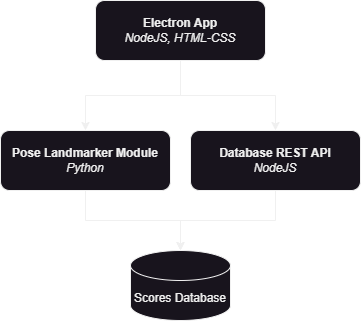

# Yoge - A Yoga Training Aid App

A remastering of my university thesis paper on 'Yoga Training Aid via Pose Estimation' by turning it into a native application instead of a web app.
This project also doubles as an exercise on The Producer - Consumer Problem and Inter-Process Communication between programmes written in different languages (Python & NodeJS).

# Objective
We aim to create an application that is composed of different processes and services which are written in different languages.
 - REST API - Create an interface to process (CRUD) user data in a database. 
 - Interprocess Communication - Using Named Pipes to seamlessly integrate a Python process with the front-end UI.
 - Native Application Development - Dip our toes in creating native Windows applications using the .NET framework 

# Stack

>**Technologies**
>
> I am aware that MediaPIpe has a [Pose Landmarker Solution for Web](https://ai.google.dev/edge/mediapipe/solutions/vision/pose_landmarker/web_js) which would eliminate the need for the Python backend and IPC entirely, however I just planned to make this project as a sort of exercise in researching and applying IPC methods in applications.
>
> I am planning on refactoring the Python Pose Landmarker "module" to be written in C++ using the [MediaPipe Framework](https://ai.google.dev/edge/mediapipe/framework/getting_started/install) to improve performance sometime in the near future.

Using a microservices architectural pattern of sorts, the appliation will interface with a REST API for the Scores Database Module, and the Pose Estimation Module for the processing and calculation of scores.

|Technology|Name|Version|
|--|--|--|
| Pose Landmarker | MediaPipe PoseLandmarker Solution (Python) | `MediaPipe v0.10.14` |
| Interprocess Communication Method | Named Pipes (Windows API) | `python:win32file` `node:net@1.0.2` |
| Native App UI | Electron ~WPF (.NET)~ | `electron@31.1.0` |
| Database Middleware | ExpressJS (NodeJS) |  `NodeJS v20.12.2` |
| Scores Database | SQLite | - |

## Architecture
### Top Level Architecture
The application has three main parts. The Electron App, the Pose Landmarker Module, and the Database REST API. The application should connect together like this:

In the application, once a session has been started we will need the Pose Landmarker Module to communicate with the Electron app to send the processed live feed. After researching different IPC methods i've narrowed it down to 3 options: `mmaps`, `Named Pipes`, and `Websockets`. 

After looking into mmaps, i found a video discussing mmap usage in database management systems, and the cons/complaints they expressed really turned me off of the IPC method. Websockets are simple, using TCP to send packets of data from one process to another, however I've read that it isn't exactly good for large chunks of data because of the overhead, and using networking techniques for sending data within the same machine didn't really make sense to me. 

I wrote off `Named Pipes` for a while because I couldn't find the right libraries/packages to use in Python, Node, and even C++. Many videos on the topic also only talk about coding in Unix machines. But after reading more into it, I finally found out about the `Win32 API`. This really changed the game for me, and after a bit of testing, I finally got to send bytes from a Python script to a NodeJS script. And so i chose to use Named Pipes as the best solution for this problem.

### Communication Between Python and Node

